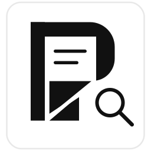
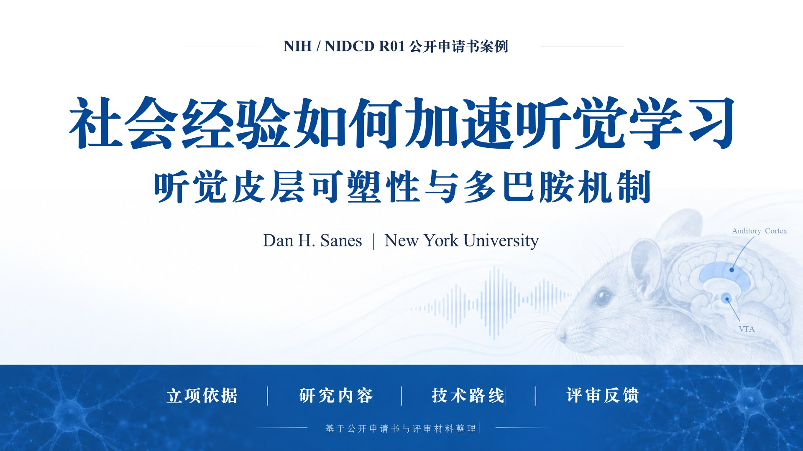
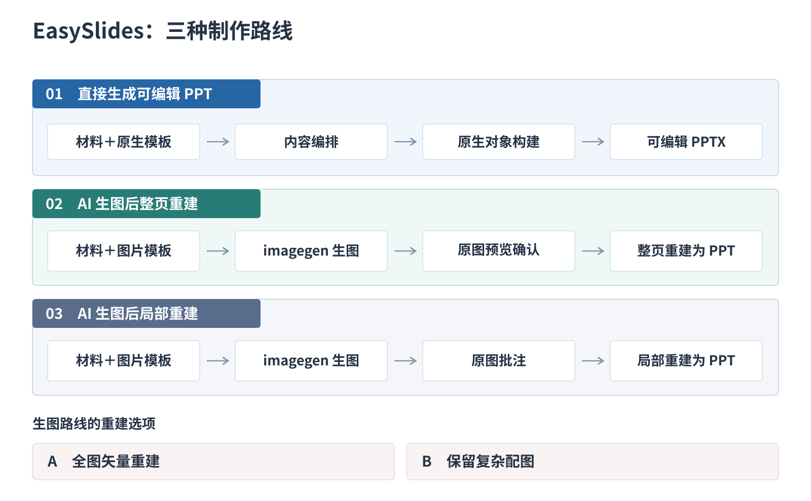

  

<h1 align="center">EasySlides</h1>

  
  
  

面向论文汇报、研究综述与答辩的 AI PPT 插件，让 Agent 基于研究材料制作可编辑 PPT。

[中文](#中文) | [English](#english)

### 先看效果

| 原生可编辑 · `literature_minimal` | 图片整页重建 · `zdyf_blue` |
| --- | --- |
|  |  |

点击缩略图查看整套 PPT；展厅支持逐页预览与下载可编辑文件。

[成品与原生模板](http://easyslides.scansci.com/?library=native#catalog) · [图片参考模板](http://easyslides.scansci.com/?library=image#catalog)

原生模板用于直接制作，图片模板用于指导生图。也支持提供自己的 PPT 或参考图片。

### 安装与开始

在 Codex 或支持技能安装的 AI Agent 中发送：

> 请帮我安装 EasySlides 的完整仓库和运行依赖，并检查能否生成 PPT：[Rimagination/easyslides](https://github.com/Rimagination/easyslides)

安装后，上传材料并说出目标：

> 用 easyslides 把这篇论文做成组会汇报，先逐项弹窗问清需求，再开始制作。

插件会询问尚未明确的材料来源、听众、目标、时长、风格与制作路径，说明相对耗时和
Token 消耗；已知信息不重复问，无需浏览器或填表。安装细节见 [安装指南](INSTALL.md)。

### 三条制作路径

复制下面一句，替换主题、材料或篇幅即可。

#### 1. 直接制作：便于反复修改内容与布局

文字与布局直接构建为可编辑元素，论文原图作为图片保留。

> 用 easyslides 基于我上传的多模态城市交通论文，使用 `literature_minimal` 模板直接制作 12 页可编辑综述，保留原图和来源，不补充外部资料。

#### 2. 整页重建：先确定完整图片页，再忠实重建

以下案例重建整页文字与简单结构，复杂配图保留为图片；已有完整图片页时可跳过生图。

> 先用联网工具搜集多模态城市交通流量预测的论文与原图，再用 easyslides 制作 12 页综述：每次 ImageGen 附上“国自然-绿色”模板参考图和适用的论文原图，逐页生成完整图片 PPT，再忠实整页重建为可编辑 PPT，保留复杂配图。

#### 3. 局部重建：只让指定区域可编辑

选中区域内的文字与简单结构可编辑，其余部分保持图片。

> 用 easyslides 局部重建我上传的多模态城市交通汇报图片，只让标题、正文和页码可编辑，保留复杂配图；先确认重建区域，其余部分保持原貌。

### 使用须知

- **工具依赖**：联网搜集依赖宿主工具，EasySlides 未内置 Deep Research 引擎；新图片生成需要可调用的 ImageGen。
- **质量检查**：图片重建先确认样页，再扩展整套；交付前核对原文证据、页码和实际渲染。详见 [重建工作流](workflows/slide-image-to-editable-pptx.md)。
- **隐私与授权**：文件在本地管理，提交给云端 AI 的材料由对应服务处理；发布私人材料及复用第三方图片前需确认授权。

<strong>开发与致谢</strong>

开发文档：[架构说明](ARCHITECTURE.md) · [工作流入口](workflows/index.md)。

EasySlides 的开发借鉴了以下公开项目的实践：

- 可编辑 PPTX 与本地生成：[hugohe3/ppt-master](https://github.com/hugohe3/ppt-master)、[Gabberflast/academic-pptx-skill](https://github.com/Gabberflast/academic-pptx-skill)。
- 学术表达：[LearnPrompt/humanize-ppt](https://github.com/LearnPrompt/humanize-ppt)。
- 风格与模板管理：[op7418/guizang-ppt-skill](https://github.com/op7418/guizang-ppt-skill)。
- 论文与文献报告：[xiao634zhang/paper-ppt-skill](https://github.com/xiao634zhang/paper-ppt-skill)、[fangyuanopus/literature-report-ppt-builder](https://github.com/fangyuanopus/literature-report-ppt-builder)。

致谢不代表这些项目对 EasySlides 的正式背书。代码许可见 [LICENSE](LICENSE)；引用、上传或再分发第三方模板与图片时，请确认对应素材的授权。

[回到顶部](#easyslides)

---

## English

A research-focused AI PPT plugin for paper presentations, literature reviews and thesis defenses.

### See the Results

[Examples and native templates](http://easyslides.scansci.com/?library=native#catalog) · [Image-reference templates](http://easyslides.scansci.com/?library=image#catalog)

Native templates support direct creation; image references guide image generation. You can also supply your own PPTX or reference images.

### Install and Start

In Codex or an Agent that supports skill installation, say:

> Please install the full [EasySlides repository](https://github.com/Rimagination/easyslides) and its runtime dependencies, and check that it can generate PPTX files.

Then ask:

> Use easyslides to turn this paper into a journal-club presentation. Ask me about the requirements step by step before creating it.

EasySlides asks about missing source, audience, goal, timing, style and production choices, with relative time and token estimates. Known answers are reused; no browser form is required. See the [installation guide](INSTALL.md).

### Three Methods, Three Examples

#### 1. Direct creation — revise content and layouts freely

> Use easyslides to create a 12-slide editable review from my uploaded multimodal traffic papers with `literature_minimal`. Preserve original figures and citations; do not add external sources.

#### 2. Full-slide reconstruction — establish the image, then rebuild it

> First use web tools to collect multimodal traffic prediction papers and original figures. Then use easyslides to make a 12-slide review: attach the “国自然-绿色” template references and relevant paper figures to each ImageGen call, generate complete slide images, and faithfully rebuild them with editable text and simple structures, preserving complex pictures.

Approved slide images can also be supplied directly, without new image generation.

#### 3. Partial reconstruction — edit selected regions only

> Use easyslides to rebuild only the titles, body text and page numbers in my traffic presentation images. Confirm the regions first; preserve complex pictures and leave everything else unchanged.

### Before You Use It

- **Dependencies:** web research uses host tools; EasySlides has no built-in Deep Research engine. New image generation requires a callable ImageGen tool.
- **Quality:** review representative rebuilt slides before expanding the deck, then check evidence, pagination and actual renders. Preserved pictures and unselected regions remain images. See the [reconstruction guide](workflows/slide-image-to-editable-pptx.md).
- **Privacy:** files stay in your workspace; cloud AI processes submitted material. Confirm permission before publishing private files or reusing third-party images.

<strong>Implementation and Credits</strong>

See [ARCHITECTURE.md](ARCHITECTURE.md) and [INSTALL.md](INSTALL.md) for development details.

EasySlides draws on public practice from [hugohe3/ppt-master](https://github.com/hugohe3/ppt-master), [Gabberflast/academic-pptx-skill](https://github.com/Gabberflast/academic-pptx-skill), [LearnPrompt/humanize-ppt](https://github.com/LearnPrompt/humanize-ppt), [op7418/guizang-ppt-skill](https://github.com/op7418/guizang-ppt-skill), [xiao634zhang/paper-ppt-skill](https://github.com/xiao634zhang/paper-ppt-skill), and [fangyuanopus/literature-report-ppt-builder](https://github.com/fangyuanopus/literature-report-ppt-builder). Acknowledgement does not imply endorsement. See [LICENSE](LICENSE) for the code license; third-party templates and images require their own permissions.

[Back to top](#easyslides)
