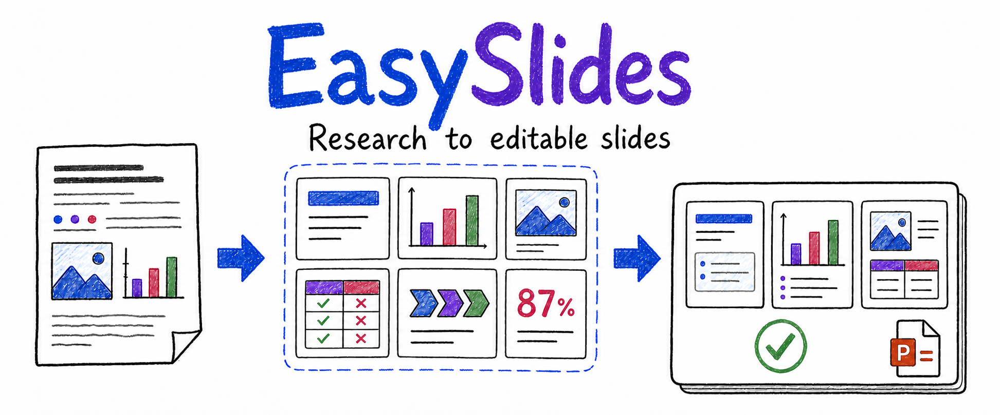

# EasySlides

[中文](#中文) | [English](#english)

## 中文

EasySlides 是一个 AI Agent 插件，面向学术报告与研究型演讲稿的本地 PPTX 生成工具。它把论文、网页、Markdown 和已有 PPT 等来源材料，转换为结构清晰、风格一致，并且可以在 PowerPoint 中继续编辑的演讲稿。

它的核心特点是：

- **自然语言协作**：你只需要说明要做什么、给谁讲、手头有什么材料。信息不清楚时，Agent 会先追问确认，再继续制作，而不是自行猜测。
- **先读懂材料，再排版**：先梳理论点、证据、图表、引用和叙事顺序，再决定每一页该讲什么，避免把论文内容机械塞进模板。
- **模板不限制内容表达**：模板提供统一的设计语言、页面壳、内容变体和组件资产。它能在保持风格一致的同时，选择适合图文、对比、流程、数据或结论的表达方式。
- **可蒸馏现有 PPT**：参考 PPT 可以被提炼为可复用模板，继承其内容组织、页面结构、组件语言和视觉节奏，而不是变成几张不可编辑的图片。
- **交付原生可编辑 PPTX**：文字、形状、颜色、图表和页面结构都可以继续在 PowerPoint 中修改；文字容量、垂直居中、对齐、几何关系与视觉质量会经过交付检查。

它的目标不是生成一份“看起来像 PPT”的图片，而是和你一起完成一套真正能讲、能改、能复用的学术演示文稿。

## 适合什么

- 把论文、报告、网页或 Markdown 做成组会汇报、文献精读、课程展示、开题或答辩 PPT。
- 依据已有 PPT 的风格制作一套新的汇报，并将这份风格沉淀为今后可复用的模板。
- 把零散材料组织成有研究问题、有证据、有结论的演讲叙事。
- 在需要严格保留图表、引用、编辑能力和本地资料控制权的研究场景中制作 PPT。

## 你会得到什么

一次完整协作会得到一套可以继续工作的演示成果：

- **可演讲的内容结构**：明确每一页的角色、标题、要点、图表与前后逻辑，而不是只给一串摘要。
- **风格一致的页面**：根据模板和材料选择恰当的内容变体，避免所有页面套用同一个大文本框。
- **原生 PPTX 文件**：可以在 PowerPoint 中改字、换图、增删页面和继续完善，而不是只能导出为图片或 PDF。

## 与常见方案有什么不同

| 关注点 | EasySlides | 常见云端 AI PPT 工具 | 传统模板与排版工具 | 代码型幻灯片工具 |
| --- | --- | --- | --- | --- |
| 使用方式 | 用自然语言与 Agent 协作 | 生成后再手动调整 | 人工拖拽和排版 | 编写代码或标记语言 |
| 对材料的处理 | 从论点、证据、图表和引用组织叙事 | 更适合快速概括和视觉初稿 | 依赖用户先整理内容 | 依赖开发者准备内容与结构 |
| 模板复用 | 蒸馏页面壳、内容变体和组件资产 | 多为主题皮肤或固定版式 | 多为静态母版和单页素材 | 组件可复用，但需要自行实现设计规则 |
| 交付结果 | 本地生成的原生可编辑 PPTX | 导出能力因平台而异 | 原生 PPTX | 取决于渲染链路 |
| 质量检查 | 内容容量、对齐、模板边界与视觉检查进入交付门槛 | 通常需要人工复核 | 主要依赖人工检查 | 主要依赖开发者自行测试 |

## 快速使用

### 1. 安装

把下面这句话发给 Codex 或支持安装技能的 AI Agent：

> 请帮我安装这个插件：
> [Rimagination/easyslides](https://github.com/Rimagination/easyslides)

### 2. 开始制作 PPT

安装完成后，直接像与研究助理沟通一样提出任务：

> 把这篇论文做成 15 页的组会汇报，突出研究问题、方法和实验结论。

> 参考这份答辩 PPT 的风格，蒸馏出一个可复用模板，再用我的开题材料做一套新 PPT。

> 如果材料里没有说清汇报对象、时长或模板，先问我再开始。

### 3. 补充你的偏好

你可以继续告诉 Agent 需要强调的结果、必须保留的图表、希望避开的表达方式，或直接提供一份参考 PPT。它会把这些要求纳入内容组织与页面选择，而不是在完成后才被动修改。

## 应用案例：从论文到组会汇报

例如，用户可以说：“我要做一次面向实验室同学的 *Attention Is All You Need* 论文精读汇报，重点讲 Transformer 为什么有效。”

EasySlides 会先确认听众背景、汇报时长和讲述重点，然后围绕问题背景、核心方法、关键结构、实验结果、局限与讨论组织页面。论文中的图表和引用可以被保留在相应页面中，每一页再根据内容选择恰当的图文、流程、对比或结论表达。

最终得到的是一套可以在 PowerPoint 中修改标题、替换图表、补充实验并继续演讲的 PPTX，而不是一份只能观看的长图。

## 模板与案例展厅

访问 [EasySlides 模板与案例展厅](http://easyslides.scansci.com/) 查看真实页图、模板名称、Transformer 文献汇报、两种答辩版式，以及可下载的 PPTX 案例。

在 EasySlides 中，模板由四层内容共同构成：

- **设计语言**：字体、色彩、留白、标题层级和视觉节奏。
- **稳定页面壳**：封面、目录、章节、内容和结束页。参考 PPT 没有目录时，不会被强行补上目录。
- **内容变体**：图文并列、流程、对比、研究路径、数据洞察、方法拆解和结论聚焦等页面组织方式。
- **组件资产**：标题栏、导航、卡片、图表、图标、标注和局部装饰；每个组件都有明确的用途、容量与对齐规则。

## 隐私与资料控制

EasySlides 在本地项目工作区组织材料与生成结果。论文原文、参考 PPT、预览图、导出的演示文件和本地质量检查结果默认不提交到 Git。请只在明确授权后再发布包含私人研究材料的内容。

<strong>项目结构、开发信息与致谢</strong>

 

日常使用不需要直接操作这些目录；它们用于让 Agent、模板和质量检查协同工作。

| 目录或文件 | 用途 |
| --- | --- |
| `SKILL.md` | Agent 的主操作说明与任务路由。 |
| `scripts/` | 材料转换、项目管理、模板蒸馏、渲染、PPTX 导出与检查工具。 |
| `templates/` | 页面模板、内容变体、组件、图表与图标资产。 |
| `assets/` | README 与产品视觉资源。 |
| `references/` | 写作、叙事、设计与质量规则。 |
| `workflows/` | 预览、模板创建、图表验证等扩展工作流。 |
| `tests/` | 模板契约、命令入口与核心能力的回归测试。 |

EasySlides 参考并扩展了 [hugohe3/ppt-master](https://github.com/hugohe3/ppt-master)、[Gabberflast/academic-pptx-skill](https://github.com/Gabberflast/academic-pptx-skill)、[LearnPrompt/humanize-ppt](https://github.com/LearnPrompt/humanize-ppt)、[op7418/guizang-ppt-skill](https://github.com/op7418/guizang-ppt-skill)、[xiao634zhang/paper-ppt-skill](https://github.com/xiao634zhang/paper-ppt-skill) 和 [fangyuanopus/literature-report-ppt-builder](https://github.com/fangyuanopus/literature-report-ppt-builder) 的公开实践。上述致谢不代表这些项目对 EasySlides 的正式背书。

[回到顶部](#easyslides)

---

## English

EasySlides is an AI Agent plugin for creating local, editable PPTX decks for academic talks and research presentations. It turns papers, web pages, Markdown, and reference decks into presentations with a clear narrative, coherent visual language, and native PowerPoint editability.

Its core characteristics are:

- **Natural-language collaboration**: describe the task, audience, and material. The Agent asks clarifying questions rather than guessing when the brief is incomplete.
- **Material before layout**: claims, evidence, figures, citations, and narrative sequence are organized before page design begins.
- **Templates with range**: templates provide a visual language, stable page shells, body variants, and components instead of a small fixed page set.
- **Reusable distillation**: a reference deck can become reusable template assets that preserve its organization, hierarchy, and visual rhythm.
- **Editable, reviewed delivery**: text, shapes, colors, charts, and structure remain editable in PowerPoint, with capacity, alignment, geometry, and visual checks before delivery.

### Best for

- Journal clubs, literature reviews, research updates, courses, proposals, and thesis defenses.
- Creating a new deck in the style of an existing presentation, then retaining that style as a reusable template.
- Turning scattered research material into an evidence-based story that can be presented and edited.

### Get started

In Codex or an AI Agent that supports skill installation, say:

> Please install this plugin: [Rimagination/easyslides](https://github.com/Rimagination/easyslides)

Then describe the deck in natural language: “Turn this paper into a 15-slide journal-club deck and focus on the research question, method, and results.”

### Gallery

See real slide pages, templates, and downloadable examples in the [EasySlides gallery](http://easyslides.scansci.com/).

<strong>Repository structure and credits</strong>

 

`SKILL.md` routes Agent tasks; `scripts/` contains conversion, distillation, rendering, export, and QA utilities; `templates/` contains layouts, variants, components, charts, and icons; `references/` records authoring and design rules; and `tests/` protects the core contracts.

EasySlides builds on public practice and inspiration from [hugohe3/ppt-master](https://github.com/hugohe3/ppt-master), [Gabberflast/academic-pptx-skill](https://github.com/Gabberflast/academic-pptx-skill), [LearnPrompt/humanize-ppt](https://github.com/LearnPrompt/humanize-ppt), [op7418/guizang-ppt-skill](https://github.com/op7418/guizang-ppt-skill), [xiao634zhang/paper-ppt-skill](https://github.com/xiao634zhang/paper-ppt-skill), and [fangyuanopus/literature-report-ppt-builder](https://github.com/fangyuanopus/literature-report-ppt-builder). These acknowledgements do not imply formal endorsement.

[Back to top](#easyslides)
